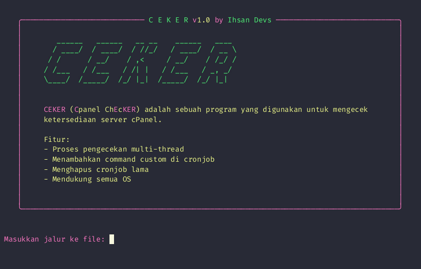

# CEKER (Cpanel chEcKER)

Tool untuk mengecek ketersediaan server cPanel.

> Request tools lainnya?\* [chat saya aja](https://t.me/IhsanDevs)

## Daftar Isi

- [Demo](#demo)
- [Fitur](#features)
- [Instalasi](#installation)
- [Penggunaan](#usage)

## Demo



## Features

- Proses pengecekan multi-thread
- Menambahkan command custom di cronjob
- Menghapus cronjob lama
- Mendukung semua OS

## Installation

```bash
git clone https://github.com/IhsanDevs/ceker
```

```bash
cd ceker
```

## Usage

```javascript
py main.py
```
